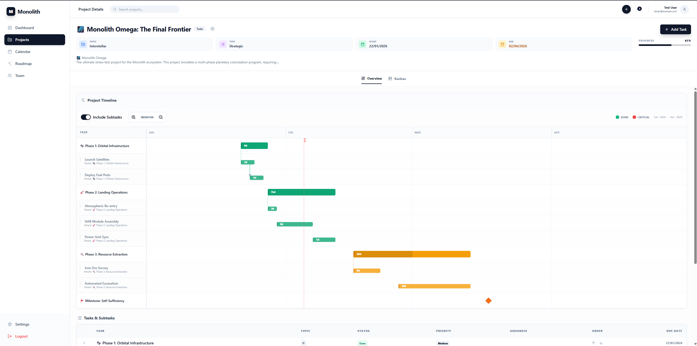

# 🗿 Monolith

[](https://www.docker.com/)
[](https://opensource.org/licenses/MIT)
[](https://fastapi.tiangolo.com/)
[](https://reactjs.org/)

**Monolith** is a high-performance, dockerized project management platform built for technical teams. It enforces a strict **Project → Task → Subtask** hierarchy and provides advanced high-density visualizations to turn complex roadmaps into actionable plans.

---


## 🚀 Key Features

- **🎯 Strict Hierarchy:** Maintain absolute clarity with a 3-level structure. Subtask completion automatically drives Task progress, which in turn updates Project completion metrics.
- **📊 High-Density Visualizations:**
    - **Advanced Gantt:** Orthogonal stepped lines, dependency Z-shapes, and multi-level zoom (Day to Year).
    - **Smart Kanban:** Automatically switches between Tasks and Subtasks based on hierarchy depth.
    - **Activity Heatmap:** GitHub-style contribution tracking (Last 12 months rolling).
- **🤖 AI-Ready (MCP):** Integrated **Model Context Protocol** server allows AI agents to autonomously manage your projects, tasks, and subtasks.
- **⚡ Technical Excellence:**
    - Manual sorting with `sort_index` (Up/Down).
    - Recursive dependency tracking.
    - Markdown support for descriptions.
    - Fully Dockerized (Nginx, FastAPI, React, Postgres).

---

## 🛠️ Tech Stack

- **Frontend:** React 18, TypeScript, Tailwind CSS, Shadcn/UI, Lucide Icons.
- **Backend:** FastAPI, SQLAlchemy (Async), PostgreSQL.
- **Infrastructure:** Docker & Docker Compose, Nginx.
- **AI Integration:** Model Context Protocol (MCP).

---

## 🏁 Quick Start

### Prerequisites
- Docker & Docker Compose installed.

### 1. Launch the Stack
```bash
docker-compose up -d --build
```

### 2. Access the Application
- **Frontend:** [http://localhost:8080](http://localhost:8080)
- **API Docs:** [http://localhost:8080/api/docs](http://localhost:8080/api/docs)
- **MCP Server:** Listening for stdio/SSE in the `monolith_mcp` container.

### 3. Default Credentials
- **Superuser:** `admin@admin.com`
- **Test User:** `tester@example.com`

---

## 🤖 MCP Integration

Monolith comes with a standalone MCP container. You can connect your favorite AI agent (e.g., Claude, Gemini) to the MCP server to automate your workflow.

**Available MCP Tools:**
- `create_project`: Generate new projects with metadata.
- `create_task` / `create_subtask`: Build out hierarchies.
- `search_projects`: Find project IDs by name.
- `update_task_status`: Real-time progress updates.
- `delete_project`: Full lifecycle management.

---

## 📦 Project Structure

```text
Monolith/
├── backend/          # FastAPI application & Database models
├── frontend/         # React application (Vite)
├── mcp/              # MCP Server entrypoint & Agent scripts
├── nginx/            # Reverse proxy configuration
└── docker-compose.yml # Full stack orchestration
```

---

## 🤝 Contributing

We welcome contributions! Please see our documentation for internal conventions and component structures.

1. Fork the Project.
2. Create your Feature Branch (`git checkout -b feature/AmazingFeature`).
3. Commit your Changes (`git commit -m 'Add some AmazingFeature'`).
4. Push to the Branch (`git push origin feature/AmazingFeature`).
5. Open a Pull Request.

---

## 📄 License

Distributed under the MIT License. See `LICENSE` for more information.

---
*Created by the Monolith Team - 🌌 To the stars through projects.*
