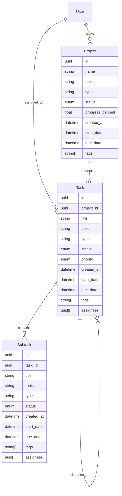

# Product Requirements Document (PRD): Project Planner Application

## 1. Executive Summary
**Project Name:** Project Planner (Internal Codename: *Monolith Planner*)
**Vision:** A robust, dockerized project management platform designed for technical teams. It combines hierarchical task management (Project > Task > Subtask) with high-level visualization tools (Gantt, Activity Heatmaps) and AI-readiness via a Model Context Protocol (MCP) module.
**Key Differentiator:** Seamless status propagation through the hierarchy and a "GitHub-style" contribution graph for visual progress tracking, all built on a modern React + Python stack.

## 2. Tech Stack Recommendations

### Frontend
*   **Framework:** React 19 (using Vite for build tooling).
*   **Language:** TypeScript (strict mode).
*   **State Management:** TanStack Query (React Query) for server state; Zustand for local UI state.
*   **UI Component Library:** Shadcn/UI (Tailwind CSS based) for a clean, accessible, and customizable design system.
*   **Visualization:** 
    *   `recharts` for generic charts.
    *   `d3-gantt` or a custom SVG implementation for the Gantt chart to ensure performance with many items.
    *   `react-calendar-heatmap` for the contribution graph.

### Backend
*   **Framework:** FastAPI (Python 3.12+). Async by default, auto-generated OpenAPI docs.
*   **Database:** PostgreSQL. Reliable, robust support for relational data and JSONB if needed.
*   **ORM:** SQLAlchemy (Async) or Prisma Client Python.
*   **AI/MCP:** A dedicated module implementing the Model Context Protocol (MCP) server standard, allowing external AI agents to query/mutate project data safely.

### Infrastructure & DevOps
*   **Containerization:** Docker & Docker Compose (dev & prod).
*   **Reverse Proxy:** Nginx (or Traefik) to route traffic between React and FastAPI containers.
*   **File Storage:** Local Docker Volume (e.g., `monolith_media` mapped to `/app/media`) to ensure data persistence across container restarts without needing external cloud storage for the MVP.

## 3. User Personas
1.  **The Architect (Admin/Owner):** Creates projects, defines teams, and views high-level Gantt/Calendar charts to track roadmap alignment.
2.  **The Builder (Developer/Member):** Focuses on Tasks and Subtasks. Updates status, adds notes/attachments, and wants to see their "contribution graph" light up.
3.  **The AI Agent (MCP Client):** An automated entity that reads project status or updates tasks via the MCP interface.

## 4. Functional Requirements

### 4.1 Hierarchy & Data Management
*   **Structure:** Strict `Project -> Task -> Subtask` hierarchy.
*   **CRUD Operations:** Full Create/Read/Update/Delete for all three levels.
*   **Dependencies:** 
    *   Support `Finish-to-Start` dependencies between Tasks and Subtasks.
    *   Visual warning if a dependency blocks completion.
*   **Status Propagation (Automated Logic):**
    *   If all *Subtasks* are `Completed`, parent *Task* moves to `Completed`.
    *   If any *Subtask* is `In Progress`, parent *Task* moves to `In Progress`.
    *   Project progress % calculated as a weighted average of Task completion.

### 4.2 Metadata & Fields
*   **Common Fields (All Levels - Projects, Tasks, Subtasks):**
    *   `UUID` (Primary Key)
    *   `Title` & `Description` (Rich Text/Markdown)
    *   `Topic` & `Type` (e.g., Topic: "Backend", Type: "Feature" or "Bug")
    *   `Status` (Backlog, Todo, In Progress, Review, Done)
    *   `Priority` (Low, Medium, High, Critical)
    *   `Owner` (User ID) & `Assignees` (List[User ID] - Required for all levels)
    *   `Dates` (Required for all levels): `created_at`, `updated_at`, `start_date`, `due_date`, `completed_at`.
    *   `Tags` (Array of strings - Required for all levels)
    *   `Attachments` (File URLs - Local Volume)
*   **Dependency Fields:** `blocked_by` (List of IDs), `blocking` (List of IDs).

### 4.3 Visualization
*   **Project Dashboard (Single Project):**
    *   **Interactive Tabs:** 
        *   **Kanban Board:** Drag-and-drop tasks between statuses.
        *   **Task List View:** A comprehensive table of all tasks and subtasks with expansion support.
        *   **Gantt Chart:** Interactive timeline of Tasks/Subtasks. Zoom levels (Day, Week, Month).
        *   **Activity Heatmap:** A "GitHub-style" graph showing task completion activity over time.
    *   **Direct Navigation:** All project references (names in lists, cards, breadcrumbs) must be clickable, leading directly to this view.
    *   **Metadata Header:** Prominent display of Project Topic, Type, Start Date, and Due Date.
    *   **Management:** Functional "Edit Project" button to modify metadata (name, dates, type).
*   **Global Dashboard (All Projects):**
    *   **Master Gantt:** High-level view of all active projects.
    *   **Master Calendar:** Monthly view of all due dates across projects.

### 4.4 MCP Module (AI Integration)
*   **Architecture:** Embedded within the Backend (FastAPI) service to share Database sessions and business logic.
*   **Access:** Exposed via standard MCP protocol (Stdio/SSE) on the backend container.
*   **Resources:** Expose `projects://`, `tasks://` as readable resources.
*   **Tools:** Expose `create_task`, `update_status`, `search_projects`, `create_user`, `update_project`, `create_subtask` as executable tools for AI agents.
  
### 4.5 Notifications
*   **Triggers:**
    *   Dependency Unblocked (e.g., Task A finishes, Task B starts).
    *   Subtask/Task Completion.
    *   Assignment (User assigned to task).
*   **Channels:**
    *   **In-App:** "Bell" icon in the UI with a dropdown of unread alerts. Real-time updates via polling or SSE.
    *   **Email:** Asynchronous email dispatch (via SMTP) for critical updates.

## 5. Data Model Draft (ER Diagram Concept)

## 6. API Endpoint Rough Sketch

*   `GET /projects` - List all projects (with filtering).
*   `POST /projects` - Create new.
*   `GET /projects/{id}/statistics` - Returns data for Gantt and Contribution graph.
*   `GET /calendar` - Returns aggregated items with due dates for a given range.
*   `POST /tasks/{id}/dependencies` - Add a dependency relation.
*   `POST /mcp` - Endpoint for AI Agent interaction.

## 7. Non-Functional Requirements
*   **Performance:** Dashboards must load within 200ms. Gantt chart must handle 500+ items without lag (windowing).
*   **Docker:** 1-command setup (`docker-compose up`).
*   **Data Integrity:** Recursive status updates must happen atomically (Database Transactions).

## 8. Risks & Mitigation
*   **Risk:** Status propagation logic becoming infinite loops if circular dependencies exist.
    *   *Mitigation:* Validate for cycles (DAG check) before saving dependency links.
*   **Risk:** Gantt chart becoming unreadable on mobile.
    *   *Mitigation:* Disable complex Gantt on mobile; default to List/Card view.

## 9. Gap Analysis & Improvement Plan (Current State Review)

### 9.1 Frontend Gaps
*   **Navigation & Discoverability:** 
    *   Project names in the "Projects List" and "Upcoming Deadlines" are now direct links.
    *   **Improvement:** Maintain prominent navigation anchors for all hierarchical levels.
*   **Missing Project Editing:**
    *   Users can now update project metadata via the "Settings" action in the project header.
*   **Task List View (Project Level):**
    *   Implemented a "List" tab in `ProjectDetailPage` with a sortable table of tasks and their subtasks.
*   **Dashboard Placeholder:** The main Dashboard (`/`) now features real statistics and links to active work.

### 9.2 Infrastructure & MCP
*   **MCP Container Visibility:** Users noted the absence of a dedicated MCP container. 
    *   **Clarification:** The MCP module is currently *embedded* within the `backend` container (`backend/app/api/api_v1/endpoints/mcp.py`) to leverage the shared Async SQLAlchemy session.
    *   **Improvement:** Documentation should clearly state how to connect an MCP Client to the Backend container (e.g., `docker exec -i monolith_backend mcp-server`).
    *   **Optional:** If distinct scaling is needed, split MCP into a separate service in `docker-compose.yml` sharing the same `backend` image but running a different entrypoint.

### 9.3 Detailed UX Requirements (Additions)
*   **Global Header:** Must include a primary "Action" button (e.g., "+" Icon) that opens a context menu to Quick Create: Project, Task (needs Project selection), or User.
*   **Empty States:** All empty states (Roadmap, Project Lists) must have functional "Create" buttons that trigger the respective creation flows.
*   **Feedback Loops:** Buttons should show loading states (spinners) during API calls (currently partially implemented in TaskForm).